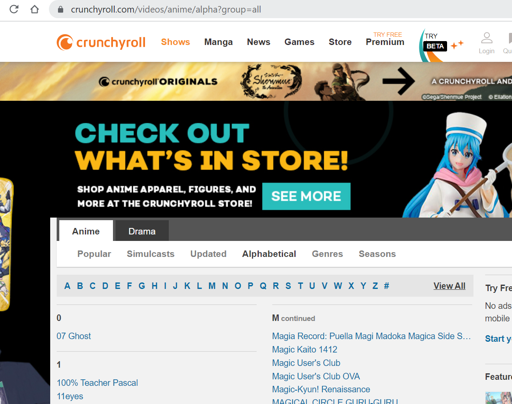
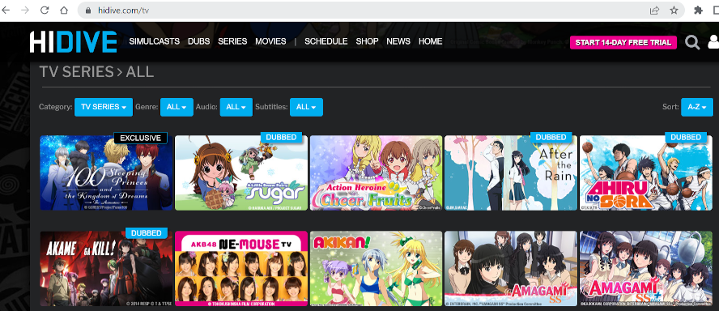
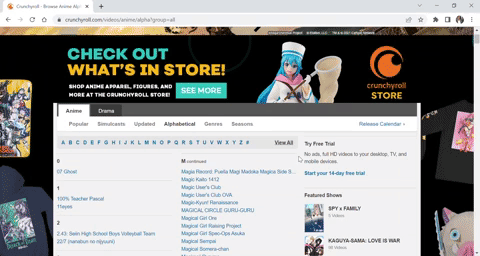
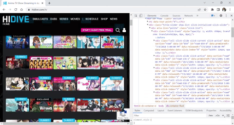
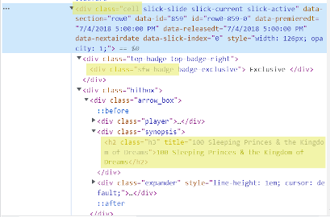

2/20/2022

# Practical Web Scraping with R and rvest: Scraping Anime listings from Crunchyroll and HIDIVE

Anime is enjoyed all over. But, finding a comprehensive listing of a
shows across different streaming platforms can be difficult to locate.
This article will focus on two large anime streaming platforms,
Crunchyroll and HIDIVE, and how to scrape their TV listings using the
`rvest` library. Results, will be posted periodically to
[kaggle.com](https://www.kaggle.com/patmendoza).

Three streaming services make up the bulk of services “[tailored for
anime
lovers](https://www.vulture.com/article/best-anime-streaming-services.html)”,
Crunchyroll, Funimation, and HIDIVE. In March, Crunchyroll started
[merging](https://www.crunchyroll.com/anime-news/2022/03/01/funimation-content-moving-to-crunchyroll-for-worlds-largest-anime-library)
their titles with Funimation making them an even more important player
in anime streaming. HIDIVE while not as large, offers an impressive
amount of dubbed titles making them appealing to viewers with a
predilection for seeing titles in english or the visually impaired.

Thankfully, both
[Crunchyroll](https://crunchyroll.com/videos/anime/alpha?group=all) and
[HIDIVE](https://www.hidive.com/tv) have great webpages that list all of
their anime.

Here is Crunchyroll’s page, which has a straightforward alphabetical
listing of all their titles:

<figure>

</figure>

And here is HIDIVE’s, which we’ll see later has a bit more information:

<figure>

</figure>

In a subsequent post, I’ll ensure I have consistent names across both
these sites as well as MyAnimeList using a string comparison library,
`fuzzyjoin`.

### Legality of scraping

In an effort to ensure that no proprietary information is being scraped
without permission, I’ve checked the robots.txt pages for each of the
root websites to ensure that these pages are allowed to be crawled.

Additionally, a [recent court
case](https://techcrunch.com/2022/04/18/web-scraping-legal-court/)
confirmed that web scraping publicly available websites is legal.

### Additional Rationale

I have a [tableau
dashboard](https://public.tableau.com/app/profile/patrick.mendoza5877/viz/WhatAnimetoWatchNextMyAnimeList/Dashboard)
that is an exploratory view of top ranked and popular anime titles based
on data from <http://myanimelist.net>. The purpose of this dashboard is
to assist the end-user in locating their next anime to watch. However,
the streaming platform is a key element that has been missing. If you
find a great anime, it doesn’t do you any good if you don’t currently
subscribe to the service. This code will attempt to mitigate that gap.

## First things first - setting some variables

Set your working directory to wherever you’d like in the
`WORKINDIRECTORY` section.

``` r
wd1 = WORKINGDIRECTORY
setwd(wd1)
```

## Install and load any libraries

The `tidyverse` contains the `rvest` library which will be used to
scrape the data, while `tidyverse` will be used to manipulate/transform
data.

``` r
install.packages(c("tidyverse"))
```

Next, we want to load the two libraries:

``` r
library(tidyverse)
library(rvest)
```

Although `rvest` is a component of the `tidyverse`, it doesn’t
automatically load with the library call `tidyverse`, as a result,
you’ll need to load it separately.

### Scraping the Crunchyroll Title List

The first thing that we want to do is read in the webpage using the
`read_html` function within the `rvest` library.

``` r
crunchyroll <- read_html('http://crunchyroll.com/videos/anime/alpha?group=all')
```

Lets examine the webpage to see if we can limit our scraping. To do so,
right click on the webpage and choose “inspect.” Once you do that you’ll
be able to navigate the code to see which xml path encompasses the area
you want to examine (see below - once the node has been found in the
inspection window, right click and choose Copy &gt; Copy full XPath).



In our case, the XPath is
“/html/body/div\[2\]/div\[2\]/div/div\[3\]/div\[2\]/div\[1\]/div\[2\].”
And we set it below using the `html_element` function.

``` r
crunchyrollbucket <- crunchyroll %>%
  html_element(xpath = "/html/body/div[2]/div[2]/div/div[3]/div[2]/div[1]/div[2]")
```

Normally, we may have to examine the webpage to check the structure of
the HTML and determine if there is any additional information that we
want to capture.

In this case, we don’t have to do that. By looking at the webpage, we
can see that the titles are all links, and that the string we want to
capture is the text that resides between the two link tags
(`<a>TEXT HERE</a>`).

The `rvest` functions below will carry that out for us.

``` r
crunchyroll_titles <- crunchyrollbucket %>% 
  html_elements('a') %>%
  html_text(trim = TRUE)
```

The combination of piping (`%>%`) and `rvest` functions pull all html
that is associated with links (`html_elements`) then takes the text that
is between those tags and trims them for whitespace (`html_text`).

Lets look at the top and bottom of our vector and see if it looks good.

``` r
knitr::kable(head(crunchyroll_titles, n=10), "pipe") 
```

| x                                                       |
|:--------------------------------------------------------|
| 07 Ghost                                                |
| 100% Teacher Pascal                                     |
| 11eyes                                                  |
| 2.43: Seiin High School Boys Volleyball Team            |
| 22/7 (nanabun no nijyuuni)                              |
| 8 Man After                                             |
| 86 EIGHTY-SIX                                           |
| 91 Days                                                 |
| <DOGEZA>I Tried Asking While Kowtowing.                 |
| A Bridge to the Starry Skies - Hoshizora e Kakaru Hashi |

``` r
knitr::kable(tail(crunchyroll_titles, n=10), "pipe") 
```

| x                                                        |
|:---------------------------------------------------------|
| YU-NO: A Girl Who Chants Love at the Bound of This World |
| YUKI YUNA IS A HERO                                      |
| Yuri!!! on ICE                                           |
| Yurumates3Dei                                            |
| YuruYuri                                                 |
| Yuuna and the Haunted Hot Springs                        |
| Zapuni                                                   |
| Zo Zo Zombie                                             |
| ZOMBIE LAND SAGA                                         |
| Zombie Loan                                              |

The first and last entries match the website, so we’re good. The last
two steps are converting to a dataframe and exporting as a csv file.

``` r
df <- data.frame(title = crunchyroll_titles)
write.csv(df, 'crunchyrolltitles.csv', row.names = FALSE) 
```

And that’s it! Some webpages are generated with Javascript and require
more finesse to scrape - this may be covered in a future post.

### Scraping the HIDIVE Title List

The first thing that we want to do is read in the webpage using the
`read_html` function within the `rvest` library.

``` r
HIDIVE <- read_html('https://www.hidive.com/tv')
```

Once again, lets examine the webpage to see if we can limit our
scraping.

In this case, the xpath is “/html/body/div\[1\]/div.” Lets set it below:

``` r
HIDIVEbucket <- HIDIVE %>%
  html_element(xpath = "/html/body/div[1]/div")
```

When examining the structure of the HTML we can see that each title is
separated into their own `div` of class “cell” that contains alot of
information about the anime including:

-   data-premieredt
-   data-releasedt
-   data-nextairdate



Additionally, if we keep expanding those sections, we find that the
title is housed within “h2” headers.

Lastly, there are div classes of type “div.sfw-badge” that contain
information on whether the title is an exclusive or dubbed.

<figure>
<figcaption aria-hidden="true">hidive html layout</figcaption>
</figure>

Ok, lets grab the title and date information first:

``` r
anime_title <- HIDIVEbucket %>%
  html_elements('h2') %>%
  html_text(trim = TRUE)

anime_premiere <- HIDIVEbucket %>%
  html_elements('div.cell') %>%
  html_attr('data-premieredt')

anime_release <- HIDIVEbucket %>%
  html_elements('div.cell') %>%
  html_attr('data-releasedt')

anime_nextair <- HIDIVEbucket %>%
  html_elements('div.cell') %>%
  html_attr('data-nextairdate')
```

Using the `html_attr` function, we can access the data that resides
within the div tag itself. This is different from before when we pulled
in the text that was between our link (`<a>`) tags using `html_text`.

Lets check the length of all of these to make sure that we’ve captured
all titles and that there isn’t an inconsistency in what we’ve captured.

``` r
length(anime_title)
```

    ## [1] 429

``` r
length(anime_premiere)
```

    ## [1] 429

``` r
length(anime_release)
```

    ## [1] 429

``` r
length(anime_nextair)
```

    ## [1] 429

They’re all the same length which is good.

Now, there are also badges on some of the titles that contain whether or
not the anime is exclusive to HIDIVE or is dubbed. These are stored
within `div.sfw-badge` html elements.

However, there aren’t consistent `div` containers that will allow me to
align the badge attributes with the other vectors we’ve collected so
far. If you look at the webpage, not all titles have badges to collect.

For that reason, I will select all of the overall buckets for the titles
(below this is where I create the `anime_cell` variable), then run a
`for` loop to see if there are badges within those buckets. If there
aren’t badges, I’ll input an `NA` value into that row so that we have a
row for all titles. In this way, I’ll en up with the same number of
records that are in my other vectors and combining them will be that
much easier.

``` r
anime_cell <- HIDIVEbucket %>%
  html_elements('div.cell')

anime_badge <- c()

for (item in anime_cell){
   rowVal <- item %>%
     html_elements('div.sfw-badge') %>%
     html_text(trim = TRUE)
   if (identical(rowVal, character(0))){
     rowVal <- NA
   }
   anime_badge <- append(anime_badge, rowVal)
}
```

Now, lets check the length:

``` r
length(anime_badge)
```

    ## [1] 429

Great, lets add them all to a dataframe

``` r
hidive_data <- data.frame(anime_title = anime_title, anime_premiere = anime_premiere, anime_release = anime_release, anime_nextair = anime_nextair, anime_badge = anime_badge)
knitr::kable(head(hidive_data))
```

| anime\_title                                 | anime\_premiere       | anime\_release        | anime\_nextair | anime\_badge |
|:---------------------------------------------|:----------------------|:----------------------|:---------------|:-------------|
| 100 Sleeping Princes & the Kingdom of Dreams | 7/5/2018 12:00:00 AM  | 7/5/2018 12:00:00 AM  |                | Exclusive    |
| A Little Snow Fairy Sugar                    | 10/2/2001 12:00:00 AM | 10/2/2001 12:00:00 AM |                | Dubbed       |
| Action Heroine Cheer Fruits                  | 7/6/2017 12:00:00 AM  | 7/6/2017 5:00:00 PM   |                | NA           |
| After the Rain                               | 1/12/2018 12:00:00 AM | 3/31/2021 1:00:00 PM  |                | Dubbed       |
| Ahiru no Sora                                | 10/2/2019 12:00:00 AM | 9/30/2019 5:00:00 PM  |                | Dubbed       |
| Akame ga Kill!                               | 7/6/2014 12:00:00 AM  | 7/6/2014 12:00:00 PM  |                | Dubbed       |

Excellent, now all that’s left is writing it to a file:

``` r
write.csv(hidive_data, 'hidivetitles.csv', row.names = FALSE) 
```

So in conclusion, HIDIVE’s page is slightly more difficult to scrape
than Crunchyroll, but it does contain a bit more information that could
be helfpul.

## Thanks

I need to give thanks to both Crunchyroll and HIDIVE for creating
webpages with all of their titles that can be easily pulled. These are
great companies with fantastic titles.
